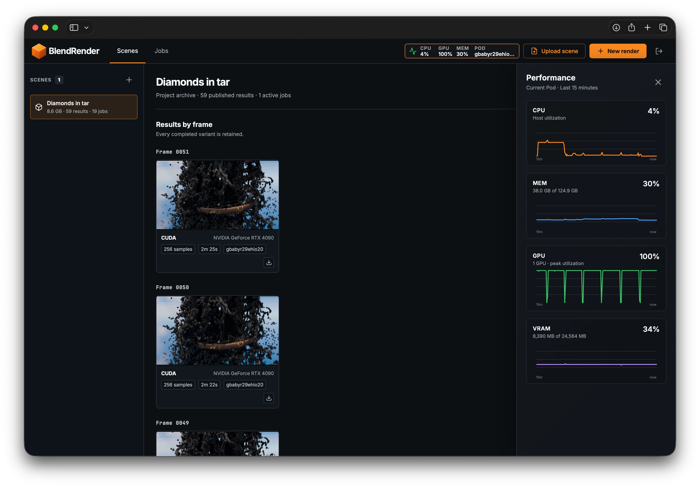

# BlendRender

<p align="center">
  
</p>

Render Blender projects on [RunPod](https://www.runpod.io/) from a web dashboard. Upload a `.blend` file or a project ZIP,
choose a frame or range, and download the results. Connect multiple Pods to one network volume to
share scenes and render in parallel.

- Resume interrupted uploads, including after a page reload.
- Use scene settings or adjust samples, tile size, and resolution for each render.
- Track progress, preview frames, and download PNGs with render metadata.
- Keep completed frames when canceling or retrying a job.
- Compare results from different Pods without overwriting earlier renders.

## RunPod quick start

1. Start from the [pre-made RunPod template](https://console.runpod.io/hub/template/irb3pt1q0h?ref=74e5k2mo). It uses the
   image published by GitHub Actions: `ghcr.io/meownoid/blendrender:main`.

2. Or build and publish your own image for `linux/amd64`:

   ```bash
   git submodule update --init --recursive
   docker buildx build --platform linux/amd64 -t YOUR_REGISTRY/blendrender:2.1.0 --push .
   ```

3. Before creating the Pod, create a RunPod network volume. Attach it at `/workspace` on every
   rendering Pod: this preserves scenes and results between runs and is required for multiple Pods
   to share work. Create an RTX RunPod Pod using the image, expose HTTP port `8000`, and set a
   long, random `APP_PASSWORD`. Keep `COOKIE_SECURE=true` for HTTPS.

4. Open `https://POD_ID-8000.proxy.runpod.net`, sign in, upload a scene, and select **New render**.

For parallel rendering, attach the same volume to additional Pods running the same image version
and password. Each Pod renders its own jobs, one at a time; all dashboards share scenes and results.

## Prepare a scene

- Upload a `.blend` with images packed, or a ZIP containing exactly one `.blend` and its external
  image resources. Use Blender-relative paths for unpacked resources.
- Make linked library data local, set an active camera, and bake simulations before upload. Include
  supported simulation caches in the project ZIP.
- BlendRender currently supports image output only.
- Third-party Blender add-ons are not supported on the render Pods. The bundled FLIP Fluids Demo is
  the only add-on provided by the production image.

See [Deployment](docs/deployment.md) for storage requirements and configuration. BlendRender is
designed for trusted users; read [Security](docs/security.md) before exposing it. See
[Scene preparation and rendering](docs/rendering.md) for details.

## Documentation

- [Scene preparation and rendering](docs/rendering.md)
- [Deployment and operations](docs/deployment.md)
- [RunPod S3 scripts guide](docs/s3-guide.md)
- [HTTP API](docs/api.md)
- [Security](docs/security.md)
- [Development and testing](docs/development.md)
- [Architecture](docs/architecture.md)
- [Documentation index](docs/README.md)
